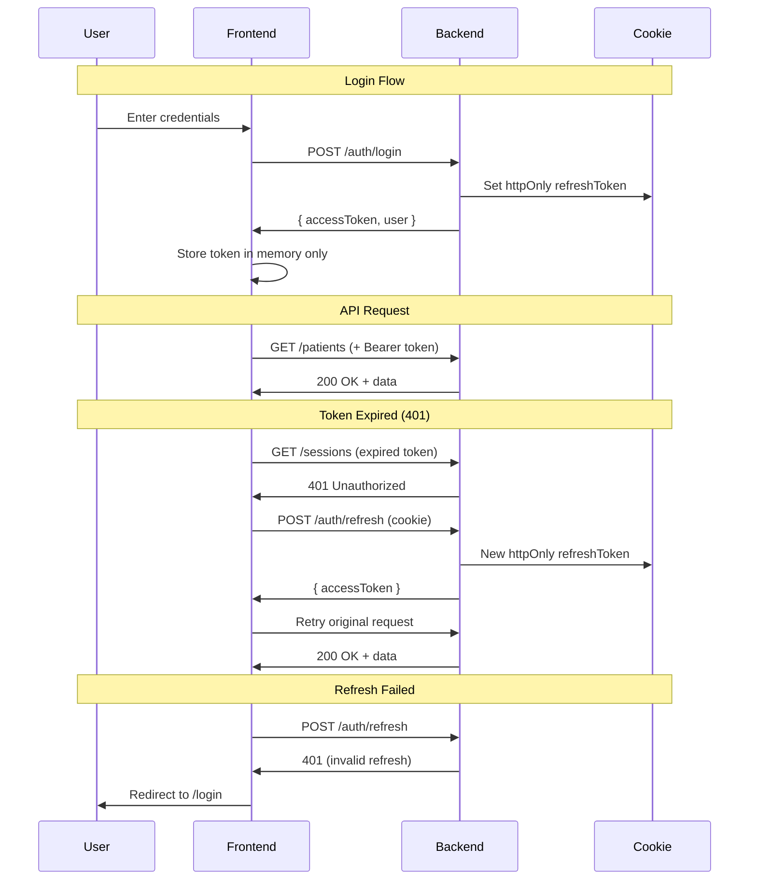
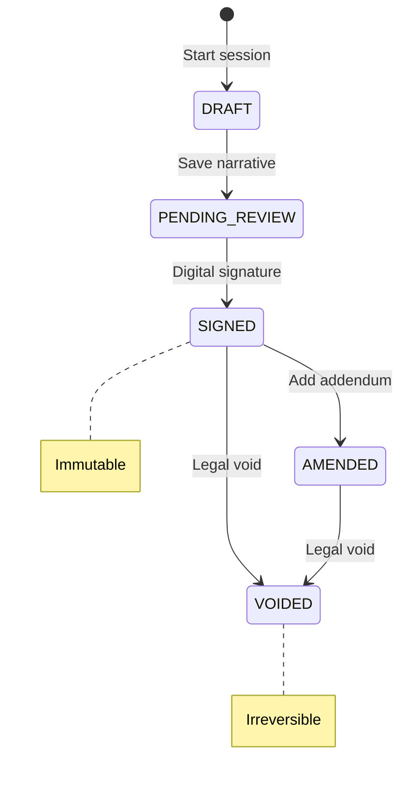
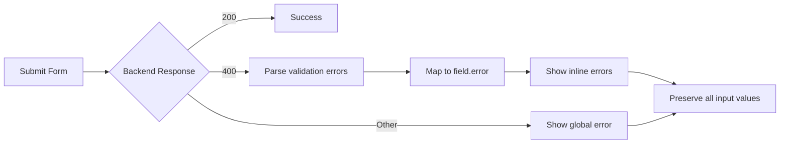

# Gestor-Psic: Frontend Architecture

> Clinical Session Management System for Psychology Practice  
> NOM-004-SSA3 Compliant • HIPAA-Aligned Security Model

---

## Authentication Flow



---

## Security Decisions

### ❌ Why NOT localStorage/sessionStorage

| Risk | Description |
|------|-------------|
| **XSS Vulnerability** | Any JavaScript can read localStorage |
| **Persistent Exposure** | Token survives browser close |
| **No Cross-Tab Isolation** | All tabs share same storage |
| **Clinical Data Risk** | PHI access tokens exposed |

**Our Solution:**
- Access token in **memory only** (JavaScript variable)
- Refresh token in **httpOnly cookie** (inaccessible to JS)
- Token lost on page refresh → automatic refresh via cookie

```typescript
// client.ts - Token in memory only
let accessToken: string | null = null;

export function setAccessToken(token: string): void {
  accessToken = token;
}
```

---

### ❌ Why NOT Automatic Timer Refresh

| Risk | Description |
|------|-------------|
| **Unnecessary Traffic** | Refresh even if user inactive |
| **Race Conditions** | Multiple tabs refreshing simultaneously |
| **State Desync** | Timer drift between frontend/backend |
| **Battery/Resource Drain** | Constant background activity |

**Our Solution:**
- Refresh **only on 401 response**
- Single retry mechanism in HTTP client
- Backend enforces actual expiration

```typescript
// client.ts - Refresh on 401 only
if (response.status === 401 && !skipAuth) {
  const refreshed = await authApi.refresh();
  if (refreshed) {
    return request(url, options, true); // Retry once
  }
}
```

---

### ❌ Why Roles are UI-Only

| Principle | Implementation |
|-----------|----------------|
| **Backend Authority** | Backend always validates permissions |
| **UI is Advisory** | Frontend shows/hides based on expected permissions |
| **Graceful Degradation** | If role wrong, backend returns 403 |
| **No Security Bypass** | Modifying frontend cannot grant access |

**Example:**
```typescript
// roles.ts - UI only helpers
/** UI: Show delete button - does NOT prevent API call */
export function canShowDeletePatientButton(role: GlobalRole): boolean {
  return role === GlobalRole.SUPERVISOR;
}

// PatientCard.tsx - Button visibility only
{canShowDeletePatientButton(user.globalRole) && (
  <Button onClick={() => deletePatient(id)}>Delete</Button>
)}

// deletePatient() ALWAYS calls API - backend validates
```

---

## Legal States (NOM-004 Compliance)

### Session Lifecycle



### UI Behavior Matrix

| State | Edit Narrative | Sign | View |
|-------|---------------|------|------|
| DRAFT | ✅ | ❌ | ✅ |
| PENDING_REVIEW | ✅ | ✅ | ✅ |
| SIGNED | ❌ | ❌ | ✅ |
| AMENDED | ❌ | ❌ | ✅ |
| VOIDED | ❌ | ❌ | ✅ |

### `isLocked` Override

When `isLocked = true` (legal hold):
- **ALL editing disabled** regardless of state
- Backend returns 423 on modification attempts
- UI shows "🔒 Bloqueada por retención legal"

```typescript
// SessionDetail.tsx
const backendAllowsEdit = isEditableLegalStatus && !session.isLocked;

{!backendAllowsEdit && (
  <span className={styles.readOnlyLabel}>Solo lectura</span>
)}
```

---

## Error Handling Strategy

### HTTP Error Mapping

| Code | Type | UI Response |
|------|------|-------------|
| 400 | Validation | Map to field errors |
| 401 | Unauthorized | Refresh → Login |
| 403 | Forbidden | "No permission" message |
| 404 | Not Found | "Not found" + redirect |
| 409 | Conflict | Show state change warning |
| 423 | Locked | Show legal hold message |
| 500 | Server Error | Generic error + retry |

### Form Error Flow



---

## Tech Stack

| Layer | Technology |
|-------|------------|
| Framework | React 18 + TypeScript |
| Routing | React Router 6 |
| Styling | CSS Modules + Design Tokens |
| HTTP | Custom fetch client |
| State | React Context (auth) |
| Build | Vite |

---

## Key Files

| File | Purpose |
|------|---------|
| `api/client.ts` | HTTP client with 401 retry |
| `auth/AuthContext.tsx` | Auth state + ProtectedRoute |
| `utils/roles.ts` | UI-only role helpers |
| `hooks/useForm.ts` | Form with 400 error mapping |
| `types/index.ts` | DTOs matching backend |

---

## Compliance Summary

| Requirement | Implementation |
|-------------|----------------|
| **Audit Trail** | Backend versioning, frontend read-only |
| **Digital Signature** | Workflow API + hash display |
| **Legal Hold** | `isLocked` flag from backend |
| **Access Control** | Backend RBAC, frontend advisory |
| **Data at Rest** | No client-side storage |
| **Session Security** | httpOnly cookies, memory tokens |
